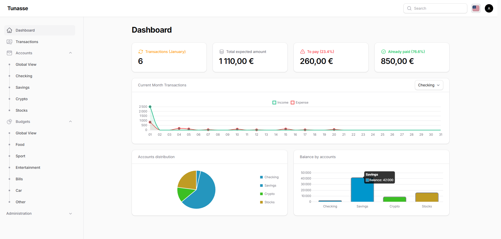

> **⚠️ Under Active Development** - Expect bugs, features may evolve.

<h1 style="text-align: center">Tunasse</h1>
<div style="text-align: center">


</div>

A personal finance management application designed to help you take control of your financial life. Built with Laravel
and Filament, it provides a modern, intuitive interface for tracking your finances across multiple accounts and budgets.

### ✨ Features
- **Transaction Management** - Track all your income and expenses with detailed categorization
- **Multi-Account Support** - Manage multiple bank accounts, savings, credits, and investment accounts
- **Multi-Budget System** - Create and monitor multiple budgets to stay on top of your spending goals
- **Recurring Transactions** - Automate tracking of regular income and expenses
- **Dashboard & Widgets** - Visualize your financial health at a glance

## 🖼️ Screenshots



## 🚀 Getting Started
### Deploy with Docker
1. **Clone the repository**
```bash
  git clone https://github.com/AxelReviron/Tunasse.git
  cd tunasse
```

2. **Setup environment variables** 
```bash
  cp .env.example .env
```


3. **Start the Docker containers**
```bash
  docker compose -f up -d
```
Application listen on `${APP_URL}:8080`

## 🚩 Roadmap
### High Priority
- [x] Docker configuration for easy deployment
- [ ] Implement tests
- [ ] Budget widgets and analytics
- [ ] User settings page
- [ ] Additional translations (Spanish, Italian, German, Portuguese, Dutch)
- [ ] Stock market price tracking integration
- [ ] Cryptocurrency price tracking
- [ ] Two-factor authentication (2FA)

### Feature Ideas
- [ ] Import transactions from CSV
- [ ] Export data to PDF/Excel
- [ ] Shared budgets
- [ ] Receipt scanning and attachment
- [ ] API for third-party integrations
- [ ] Investment portfolio tracking with performance metrics
- [ ] MCP Server (AI)

## 🤝 Contributing
### Local Development with Docker
1. **Clone the repository**
```bash
  git clone https://github.com/AxelReviron/Tunasse.git
  cd tunasse
```

2. **Setup environment variables**
```bash
  cp .env.example .env
```

3. **Start the Docker containers**
```bash
  docker compose -f compose.dev.yaml up -d
```

This will start:
- **FrankenPHP** (Laravel Octane) - Application server on `http://localhost:8000`
- **MySQL** - Main database on port `3306`
- **MySQL Test** - Test database on port `3307`

4. **Install dependencies inside the container**
```bash
  docker exec -it tunasse composer install
  docker exec -it tunasse npm install
```

5. **Install and configure Laravel Octane with FrankenPHP**

Laravel Octane with FrankenPHP provides superior performance for your application. Install it with:

```bash
  docker exec -it tunasse php artisan octane:install --server=frankenphp
```

> **Note:** This project uses FrankenPHP as the application server. The container automatically runs `php artisan octane:frankenphp` to serve your application with high performance and modern features.

6. **Generate application key**
```bash
  docker exec -it tunasse php artisan key:generate
```

7. **Run migrations and seeders**
```bash
  docker exec -it tunasse php artisan migrate --seed
```

8. **Build frontend assets**
```bash
  docker exec -it tunasse npm run build
  # Or for development with hot reload:
  docker exec -it tunasse npm run dev
```

9. **Access the application**

Open your browser and navigate to [localhost:8000](http://localhost:8000)

### 🧾 Useful Commands
#### Access container shell (makefile)
```bash
  make tunasse-docker
```
##### Run Pint and PHPStan
```bash
  make laraclean
```
##### Clear caches
```bash
  docker exec -it tunasse php artisan optimize:clear
```
