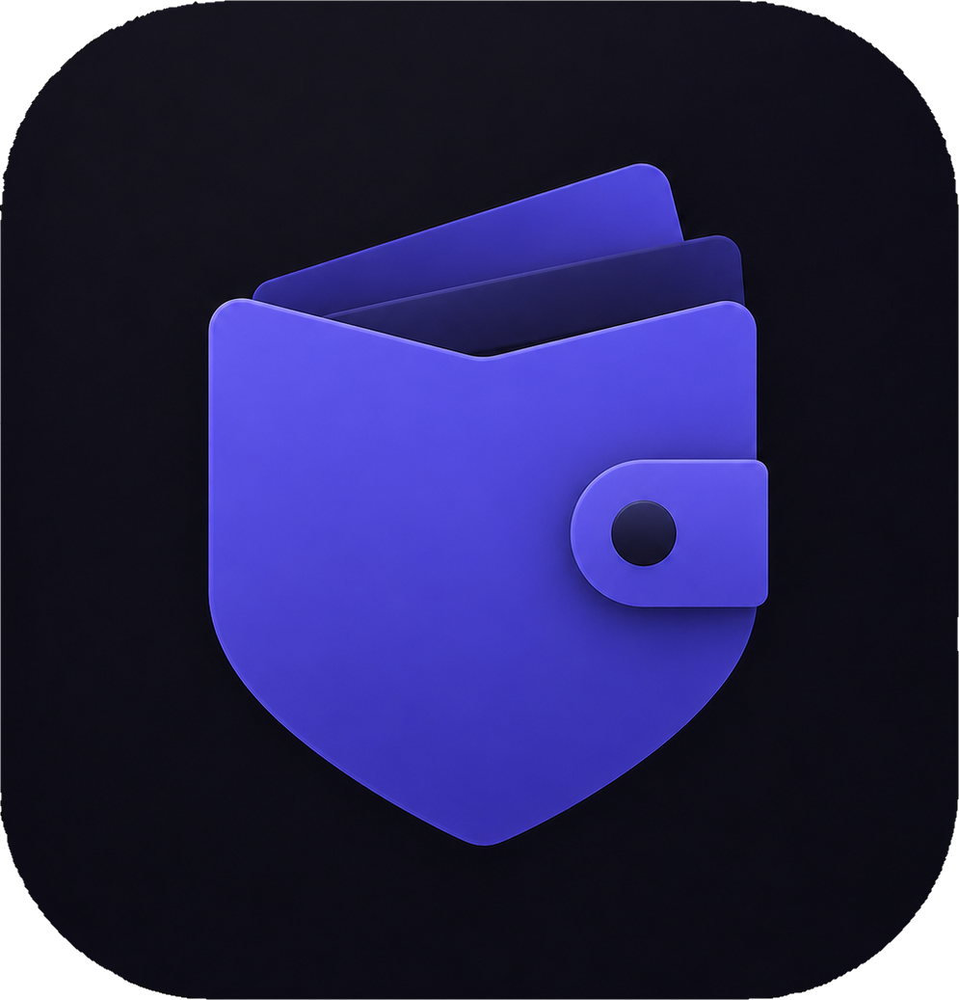

<h1 align="center">
  
  Tunasse
</h1>

<p align="center">
  <a href="https://vuejs.org"></a>
  <a href="https://ionicframework.com"></a>
  <a href="https://dexie.org"></a>
  <a href="https://web.dev/progressive-web-apps"></a>
</p>


## Privacy first

Tunasse stores everything locally on your device using IndexedDB. There is no account, no analytics, and no cloud where your data is held. Your financial data is yours — it lives on your devices.

Optional **device sync** lets you keep your devices in sync over a direct peer-to-peer connection. Data is encrypted end-to-end by DTLS; no server ever sees it in the clear.


## Features

- **Dashboard** — Balance overview, monthly income/expense, recurring bills tracker (already paid / still to pay), charts by account and budget
- **Transactions** — Income, expenses and transfers between accounts; search and filters by type, date range; recurring transactions
- **Budgets** — Monthly caps per category with progress tracking
- **Accounts** — Multiple accounts, multiple currencies, balance computed from transactions
- **Offline** — Fully functional without internet; installable as a PWA on any device


## Tech stack

| Layer          | Technology                                                                       |
|----------------|----------------------------------------------------------------------------------|
| UI framework   | [Ionic Vue](https://ionicframework.com/docs/vue/overview)                        |
| Reactivity     | [Vue 3](https://vuejs.org) Composition API (`<script setup>`)                    |
| Local database | [Dexie.js](https://dexie.org) (IndexedDB wrapper)                                |
| PWA            | [vite-plugin-pwa](https://vite-pwa-org.netlify.app) — Workbox + Web App Manifest |
| Routing        | [Vue Router](https://router.vuejs.org)                                           |
| Build          | [Vite](https://vitejs.dev) + [TypeScript](https://www.typescriptlang.org)        |
| i18n           | [Vue I18n](https://vue-i18n.intlify.dev) (English / French)                      |
| Charts         | [Chart.js](https://www.chartjs.org) via [vue-chartjs](https://vue-chartjs.org)   |
| Device sync    | [Trystero](https://github.com/dmotz/trystero) (WebRTC, peer-to-peer)             |


## Getting started

```bash
docker build -t tunasse-dev .
docker run --rm --name tunasse -p 8100:8100 -v $(pwd):/app -v /app/node_modules tunasse-dev
```

Run a command inside the container:

```bash
docker exec -it tunasse sh
```

Build for production:

```bash
npm run build
```

## Device sync

Sync between your own devices is peer-to-peer over WebRTC, built on [Trystero](https://github.com/dmotz/trystero). Peers that share the same passphrase join the same room and exchange data encrypted end-to-end by DTLS. No server ever receives or stores your data.

The signaling layer (used to exchange ICE candidates and establish the connection) carries no user data — only short connection-setup metadata.

**Network path**

WebRTC tries, in order:

1. **Direct LAN** — preferred whenever both peers are on the same network. Desktop-to-desktop sync on the same Wi-Fi goes here, with no third-party server involved.
2. **TURN relay** — fallback when a direct path fails (e.g. iOS Safari ↔ Chromium peers)

No third-party STUN or TURN server is ever used. If you need a TURN relay (typically for iOS ↔ desktop sync), you run your own — see [Self-hosting a TURN server](#self-hosting-a-turn-server) below.

## Self-hosting a TURN server

A TURN server is only needed when direct peer-to-peer connections fail. The `coturn/` directory contains a ready-to-use [coturn](https://github.com/coturn/coturn) Docker setup.

**Requirements:** Docker, Docker Compose, and a machine reachable by both devices (local network or VPS).

```bash
cd coturn
cp turnserver.conf.example turnserver.conf
```

Edit `turnserver.conf` and replace `YOUR_USERNAME` and `YOUR_PASSWORD` with credentials of your choice:

```
user=alice:supersecret
```

Then start the server:

```bash
docker compose up -d
```

The server listens on port `3478` (TCP + UDP). Make sure that port is reachable from your devices (open it in your firewall if needed).

**Connecting the app**

Open Tunasse → Settings → Advanced → TURN server and fill in:

| Field      | Value                                        |
|------------|----------------------------------------------|
| Host       | IP or hostname of the machine running coturn |
| Port       | `3478`                                       |
| Username   | the value you set in `turnserver.conf`       |
| Password   | the value you set in `turnserver.conf`       |

Hit **Save** — the app will test connectivity and show a green indicator if the server is reachable.


## Roadmap

- [x] PWA icons
- [ ] Settings page — Import/Export, full data reset
- [ ] Onboarding
